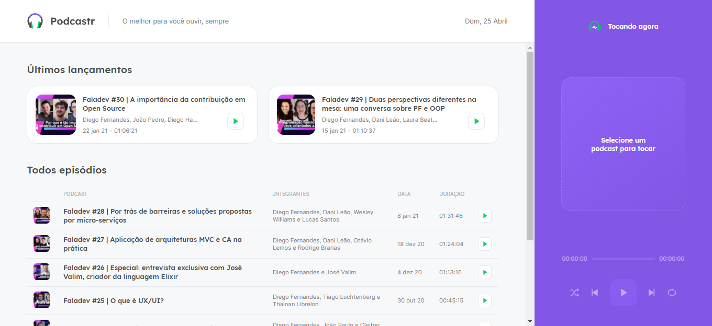

<h1 align="center">
    
</h1>

  <a href="#-instalar">Instalar</a>&nbsp;&nbsp;&nbsp;|&nbsp;&nbsp;&nbsp;
  <a href="#-tecnologias">Tecnologias</a>&nbsp;&nbsp;&nbsp;|&nbsp;&nbsp;&nbsp;
  <a href="#-projeto">Projeto</a>&nbsp;&nbsp;&nbsp;|&nbsp;&nbsp;&nbsp;
  <a href="#-layout">Layout</a>&nbsp;&nbsp;&nbsp;|&nbsp;&nbsp;&nbsp;
  <a href="#-autor">Autor</a>

 

  

## 👨🏾‍💻 Instalar  

- Instale o [Visual Studio Code](https://code.visualstudio.com/)
- Baixe o [Zip do código](https://github.com/lucas-souza19/PodcastrNLW5/archive/refs/heads/master.zip)
- -Instale as dependências yarn
- Descompacte o arquivo e abra no VS Code
- Abra o terminal do VS Code ( ctrl + " )
- Para iniciar o projeto digite: yarn run dev
- Crie um segundo terminal
- Para iniciar o servidor digite: yarn run server
- Acessa a porta [localhost:3000](http://localhost:3000) do navegador 
- Ótimo, o projeto está funcionando!

## 🚀 Tecnologias

Esse projeto foi desenvolvido com as seguintes tecnologias:

- [ReactJs](https://pt-br.reactjs.org/)
- [Next.js](https://nextjs.org/)
- [Sass](https://sass-lang.com/)
- [TypeScript](https://www.typescriptlang.org/)
- [Yarn](https://yarnpkg.com/)

## 💻 Projeto

O Podcastr é uma aplicação web interativa para ouvir podcast no próprio site. 

## 🔖 Layout

Você pode visualizar o layout do projeto no [Figma](https://www.figma.com/file/UwFEntsHpHYJlHNQAQr4gA/Podcastr?node-id=160%3A2761).

## ✍🏾 Autor

Contate-me:

---
   
Desenvolvido no Next Level Week 5 trilha ReactJs da [Rocketseat](https://rocketseat.com.br/)🚀

